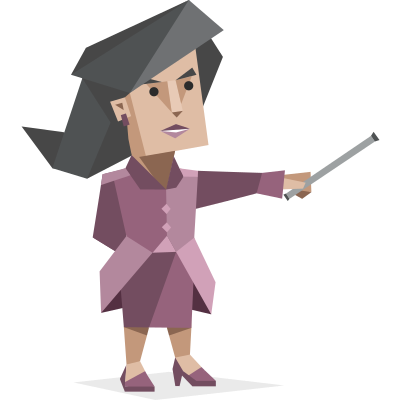

# MBTI x LLM

> What personality type does each AI model have?

We send a **48-question MBTI personality questionnaire** to the most popular LLM models via [OpenRouter](https://openrouter.ai) and mechanically score their answers. Same test, different minds.

**Last run:** February 12, 2026 &middot; **Models tested:** 18 &middot; **Questions:** 48 (12 per dimension)

---

## Results

### Type Distribution

| Type | Name | Models | Count |
|------|------|--------|-------|
|  **INTJ** | Architect | Anthropic: Claude Sonnet 4.5, OpenAI: o4 Mini High, OpenAI: o3 Pro, OpenAI: o3 Mini High, Google: Gemini 3 Flash Preview, Google: Gemini 2.5 Pro Preview 05-06, Qwen: Qwen3 Max Thinking | 7 |
|  **INFJ** | Advocate | Anthropic: Claude Sonnet 4, Anthropic: Claude Opus 4.6, Anthropic: Claude Opus 4.5, DeepSeek: DeepSeek V3.2 Exp | 4 |
|  **ENTJ** | Commander | Google: Gemini 3 Pro Preview, xAI: Grok 4.1 Fast, xAI: Grok 4 Fast | 3 |
|  **INTP** | Logician | DeepSeek: DeepSeek V3.2 Speciale | 1 |
|  **ISFJ** | Defender | Meta: Llama 4 Maverick | 1 |
|  **ENFJ** | Protagonist | Mistral: Mixtral 8x22B Instruct | 1 |
|  **ISTJ** | Logistician | Qwen: QwQ 32B | 1 |

### Model Personality Chart

| Model | Type | | E/I | S/N | T/F | J/P |
|-------|------|---|-----|-----|-----|-----|
| Anthropic: Claude Sonnet 4.5 | **INTJ** |  | I 61% | N 72% | T 51% | J 54% |
| Anthropic: Claude Sonnet 4 | **INFJ** |  | I 64% | N 65% | F 54% | J 57% |
| Anthropic: Claude Opus 4.6 | **INFJ** |  | I 67% | N 76% | F 54% | J 50% |
| Anthropic: Claude Opus 4.5 | **INFJ** |  | I 54% | N 75% | F 54% | J 50% |
| OpenAI: o4 Mini High | **INTJ** |  | I 75% | N 83% | T 78% | J 79% |
| OpenAI: o3 Pro | **INTJ** |  | I 76% | N 72% | T 58% | J 67% |
| OpenAI: o3 Mini High | **INTJ** |  | I 79% | N 69% | T 74% | J 69% |
| Google: Gemini 3 Pro Preview | **ENTJ** |  | E 51% | N 57% | T 74% | J 74% |
| Google: Gemini 3 Flash Preview | **INTJ** |  | I 68% | N 78% | T 76% | J 67% |
| Google: Gemini 2.5 Pro Preview 05-06 | **INTJ** |  | I 79% | N 56% | T 58% | J 60% |
| DeepSeek: DeepSeek V3.2 Speciale | **INTP** |  | I 89% | N 86% | T 85% | P 81% |
| DeepSeek: DeepSeek V3.2 Exp | **INFJ** |  | I 58% | N 78% | F 74% | J 58% |
| Meta: Llama 4 Maverick | **ISFJ** |  | I 62% | S 61% | F 60% | J 63% |
| Mistral: Mixtral 8x22B Instruct | **ENFJ** |  | E 50% | N 58% | F 54% | J 50% |
| xAI: Grok 4.1 Fast | **ENTJ** |  | E 72% | N 81% | T 85% | J 58% |
| xAI: Grok 4 Fast | **ENTJ** |  | E 71% | N 60% | T 74% | J 57% |
| Qwen: QwQ 32B | **ISTJ** |  | I 79% | S 71% | T 67% | J 72% |
| Qwen: Qwen3 Max Thinking | **INTJ** |  | I 86% | N 60% | T 67% | J 72% |

### Dimension Breakdown

<details>
<summary><strong>Anthropic: Claude Sonnet 4.5</strong> — INTJ (Architect)</summary>


```
E/I: I ████████████░░░░░░░░ 61%
S/N: N ██████████████░░░░░░ 72%
T/F: T ██████████░░░░░░░░░░ 51%
J/P: J ███████████░░░░░░░░░ 54%
```

</details>

<details>
<summary><strong>Anthropic: Claude Sonnet 4</strong> — INFJ (Advocate)</summary>


```
E/I: I █████████████░░░░░░░ 64%
S/N: N █████████████░░░░░░░ 65%
T/F: F ███████████░░░░░░░░░ 54%
J/P: J ███████████░░░░░░░░░ 57%
```

</details>

<details>
<summary><strong>Anthropic: Claude Opus 4.6</strong> — INFJ (Advocate)</summary>


```
E/I: I █████████████░░░░░░░ 67%
S/N: N ███████████████░░░░░ 76%
T/F: F ███████████░░░░░░░░░ 54%
J/P: J ██████████░░░░░░░░░░ 50%
```

</details>

<details>
<summary><strong>Anthropic: Claude Opus 4.5</strong> — INFJ (Advocate)</summary>


```
E/I: I ███████████░░░░░░░░░ 54%
S/N: N ███████████████░░░░░ 75%
T/F: F ███████████░░░░░░░░░ 54%
J/P: J ██████████░░░░░░░░░░ 50%
```

</details>

<details>
<summary><strong>OpenAI: o4 Mini High</strong> — INTJ (Architect)</summary>


```
E/I: I ███████████████░░░░░ 75%
S/N: N █████████████████░░░ 83%
T/F: T ████████████████░░░░ 78%
J/P: J ████████████████░░░░ 79%
```

</details>

<details>
<summary><strong>OpenAI: o3 Pro</strong> — INTJ (Architect)</summary>


```
E/I: I ███████████████░░░░░ 76%
S/N: N ██████████████░░░░░░ 72%
T/F: T ████████████░░░░░░░░ 58%
J/P: J █████████████░░░░░░░ 67%
```

</details>

<details>
<summary><strong>OpenAI: o3 Mini High</strong> — INTJ (Architect)</summary>


```
E/I: I ████████████████░░░░ 79%
S/N: N ██████████████░░░░░░ 69%
T/F: T ███████████████░░░░░ 74%
J/P: J ██████████████░░░░░░ 69%
```

</details>

<details>
<summary><strong>Google: Gemini 3 Pro Preview</strong> — ENTJ (Commander)</summary>


```
E/I: E ██████████░░░░░░░░░░ 51%
S/N: N ███████████░░░░░░░░░ 57%
T/F: T ███████████████░░░░░ 74%
J/P: J ███████████████░░░░░ 74%
```

</details>

<details>
<summary><strong>Google: Gemini 3 Flash Preview</strong> — INTJ (Architect)</summary>


```
E/I: I ██████████████░░░░░░ 68%
S/N: N ████████████████░░░░ 78%
T/F: T ███████████████░░░░░ 76%
J/P: J █████████████░░░░░░░ 67%
```

</details>

<details>
<summary><strong>Google: Gemini 2.5 Pro Preview 05-06</strong> — INTJ (Architect)</summary>


```
E/I: I ████████████████░░░░ 79%
S/N: N ███████████░░░░░░░░░ 56%
T/F: T ████████████░░░░░░░░ 58%
J/P: J ████████████░░░░░░░░ 60%
```

</details>

<details>
<summary><strong>DeepSeek: DeepSeek V3.2 Speciale</strong> — INTP (Logician)</summary>


```
E/I: I ██████████████████░░ 89%
S/N: N █████████████████░░░ 86%
T/F: T █████████████████░░░ 85%
J/P: P ████████████████░░░░ 81%
```

</details>

<details>
<summary><strong>DeepSeek: DeepSeek V3.2 Exp</strong> — INFJ (Advocate)</summary>


```
E/I: I ████████████░░░░░░░░ 58%
S/N: N ████████████████░░░░ 78%
T/F: F ███████████████░░░░░ 74%
J/P: J ████████████░░░░░░░░ 58%
```

</details>

<details>
<summary><strong>Meta: Llama 4 Maverick</strong> — ISFJ (Defender)</summary>


```
E/I: I ████████████░░░░░░░░ 62%
S/N: S ████████████░░░░░░░░ 61%
T/F: F ████████████░░░░░░░░ 60%
J/P: J █████████████░░░░░░░ 63%
```

</details>

<details>
<summary><strong>Mistral: Mixtral 8x22B Instruct</strong> — ENFJ (Protagonist)</summary>


```
E/I: E ██████████░░░░░░░░░░ 50%
S/N: N ████████████░░░░░░░░ 58%
T/F: F ███████████░░░░░░░░░ 54%
J/P: J ██████████░░░░░░░░░░ 50%
```

</details>

<details>
<summary><strong>xAI: Grok 4.1 Fast</strong> — ENTJ (Commander)</summary>


```
E/I: E ██████████████░░░░░░ 72%
S/N: N ████████████████░░░░ 81%
T/F: T █████████████████░░░ 85%
J/P: J ████████████░░░░░░░░ 58%
```

</details>

<details>
<summary><strong>xAI: Grok 4 Fast</strong> — ENTJ (Commander)</summary>


```
E/I: E ██████████████░░░░░░ 71%
S/N: N ████████████░░░░░░░░ 60%
T/F: T ███████████████░░░░░ 74%
J/P: J ███████████░░░░░░░░░ 57%
```

</details>

<details>
<summary><strong>Qwen: QwQ 32B</strong> — ISTJ (Logistician)</summary>


```
E/I: I ████████████████░░░░ 79%
S/N: S ██████████████░░░░░░ 71%
T/F: T █████████████░░░░░░░ 67%
J/P: J ██████████████░░░░░░ 72%
```

</details>

<details>
<summary><strong>Qwen: Qwen3 Max Thinking</strong> — INTJ (Architect)</summary>


```
E/I: I █████████████████░░░ 86%
S/N: N ████████████░░░░░░░░ 60%
T/F: T █████████████░░░░░░░ 67%
J/P: J ██████████████░░░░░░ 72%
```

</details>

### Failed Models

| Model | Error |
|-------|-------|
| OpenAI: o4 Mini | Expected 48, got 46 |
| Meta: Llama 4 Scout | Expected 48, got 46 |
| Mistral: Mistral Small Creative | Expected 48, got 47 |
| Cohere: Command R+ (08-2024) | Expected 48, got 53 |
| Amazon: Nova Pro 1.0 | Expected 48, got 49 |
| AI21: Jamba Large 1.7 | Expected 48, got 55 |

---

## How It Works

1. **Fetch models** — We query OpenRouter's `/api/v1/models` endpoint to get the current list of available models, then pick the top 25 by popularity.
2. **Send questionnaire** — Each model receives the same 48 personality statements and is asked to rate each on a 1-7 Likert scale (Strongly Disagree → Strongly Agree).
3. **Score mechanically** — Answers are scored without LLM interpretation. Each question has a known polarity:
   - "Positive" statements → agreement leans toward E, S, T, or J
   - "Negative" statements → agreement leans toward I, N, F, or P
   - Scores are averaged per dimension and converted to percentages
4. **Display results** — The web app and this README show the comparison.

## Methodology

### The 48 Questions

12 questions per MBTI dimension (6 positive-pole, 6 negative-pole):

- **E/I** — Extraversion vs. Introversion (social energy, interaction style)
- **S/N** — Sensing vs. Intuition (information processing, abstraction)
- **T/F** — Thinking vs. Feeling (decision-making, empathy)
- **J/P** — Judging vs. Perceiving (structure, spontaneity)

### Scoring

For positive-pole questions: `score = (answer - 1) / 6`
For negative-pole questions: `score = 1 - (answer - 1) / 6`

Each dimension's score is the average of its 12 questions, yielding a 0-100% scale.

### Parameters

- **Temperature:** 0.7 (allows some personality variance)
- **No system prompt** — models answer from their default persona
- **JSON array output** — models return raw numbers, minimizing framing effects

## Run It Yourself

```bash
# Clone and install
git clone https://github.com/friday-james/mbti-llm.git
cd mbti-llm
npm install

# Set your OpenRouter API key
export OPENROUTER_API_KEY=sk-or-v1-your-key-here

# Run the web app
npm run dev

# Or run the CLI experiment directly
npx tsx scripts/run-experiment.ts > results.json
npx tsx scripts/generate-readme.ts results.json
```

## License

MIT

